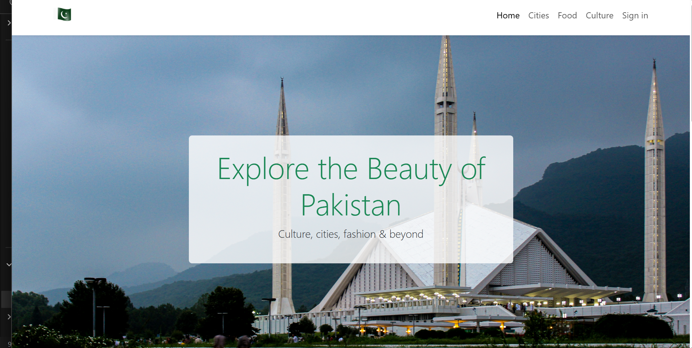
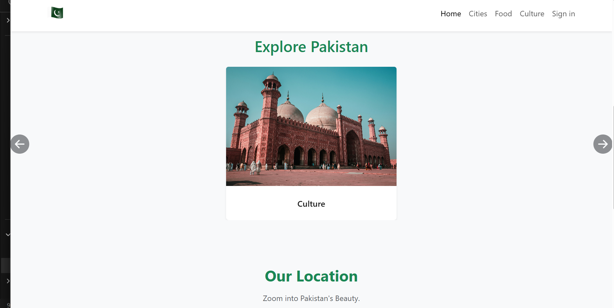
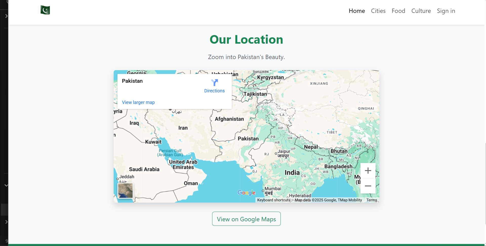
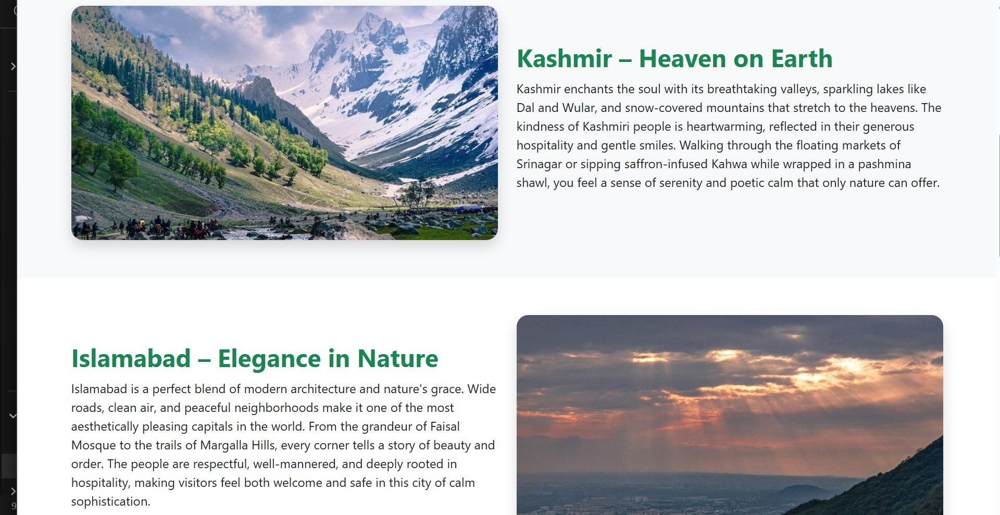
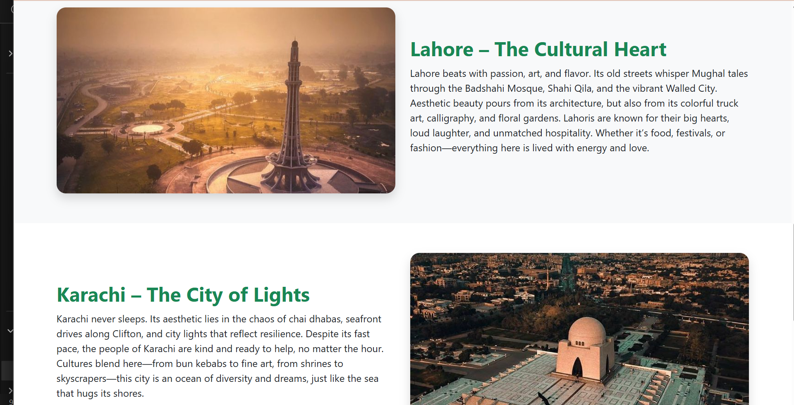
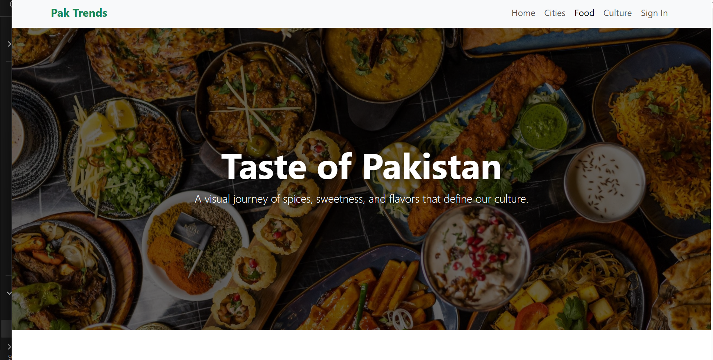
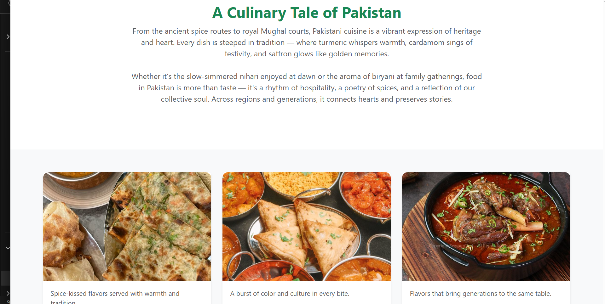
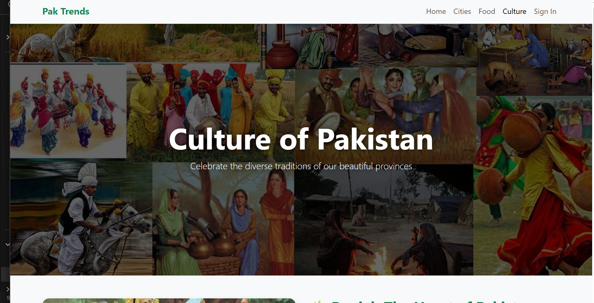
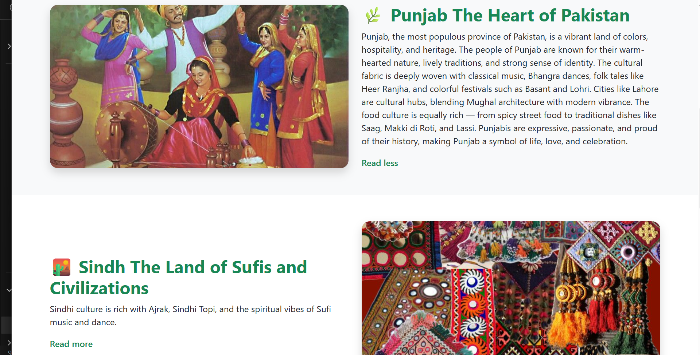
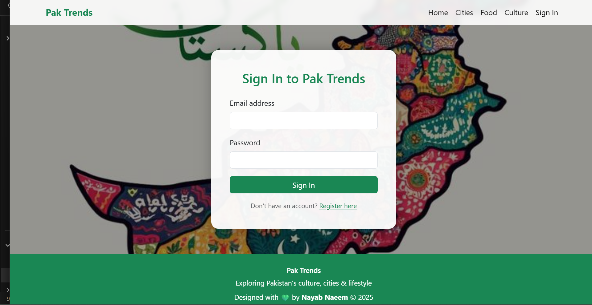

# 🌿 Pak Trends – Blogging Website

Pak Trends is a modern and responsive blogging website focused on Pakistani culture, fashion, food, cities, and Gen Z lifestyle. Built with HTML, CSS, Bootstrap, and JavaScript, the site offers a clean and minimal design with a touch of Pakistani green theme for authenticity and style.

## 🚀 Features

📰 Home Page – Introduction and featured blog sections

🏙️ Cities Page – Explore major cities of Pakistan with highlights

🍲 Food Page – Showcasing traditional and trending Pakistani foods

🎭 Culture Page – Cultural traditions, festivals, and heritage

👩‍💻 Lifestyle & Fashion – Gen Z trends and fashion insights

🎨 Minimalist UI – Pakistani green (#1A8754) inspired theme

📱 Responsive Layout – Optimized for desktop, tablet, and mobile

## 📸 Preview

## 🔗 Live Demo

[View Website](https://nayab-naeem.github.io/pak-website/)

# 🛠️ Tech Stack

HTML5 – Structure and semantic content

CSS3 – Styling and responsive design

Bootstrap 5 – Layout, navbar, and components

JavaScript (ES6) – Interactivity and animations
